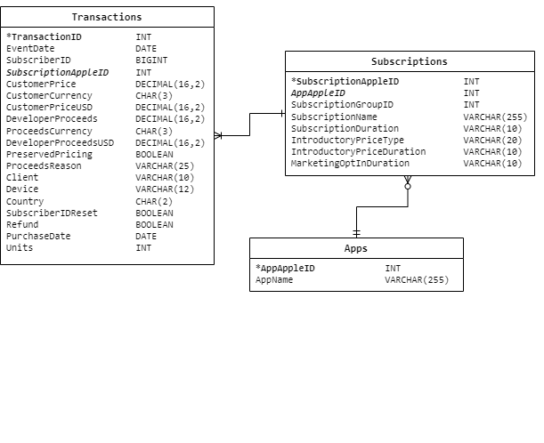

# Test Tasks for Data Analyst position

My take on the tasks I got for an Data Analyst position.

## About

This project is done with Python(Jupyter), PostgreSQL and Tableau.  
Python libraries: Pandas, Numpy, SQLAlchemy, requests, pytz (for timezine conversion).  

The scripts are next:
- 2.ipynb : Quick data cleaning before using it in Tableau. The main concern was to unify the timezones with "default" (Kyiv/Ukraine). And with that it required to fiddle with country codes. Meanwhile also added country_names column.
  The final Tableau viz is [here](https://public.tableau.com/views/BMAppRevenueAnalysis/BetterMeApp?:language=en-US&:sid=&:display_count=n&:origin=viz_share_link).
- 3.ipynb (also task3.ipynb and test.ipynb as drafts) : Database management. The task was to fit the data into the database. It was decided to make three tables: Apps, Subscriptions, Transactions.

  

  Next the dataframe cleaning and prep was described in a function. The data loading into the database was performed file by file.
- rate-api.ipynb : Quick request to openexchangerates.com to retrieve the current exchange rates to later use in 3rd task (converting to default currency).
- perform the database queries. [Link to GitHub Gist](https://gist.github.com/diShat/2a92415b0c17c3418a536149c2c6214f).

## Conclusion

Overall the test solutions were successful (with minor flaws) and got me to the interview stage.
